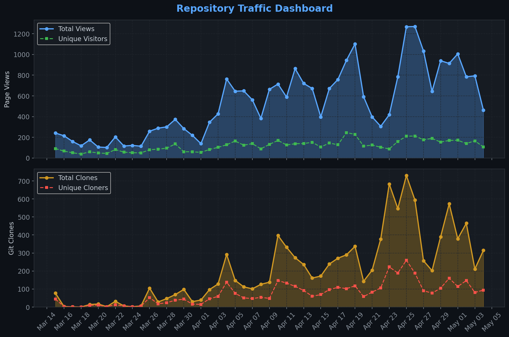
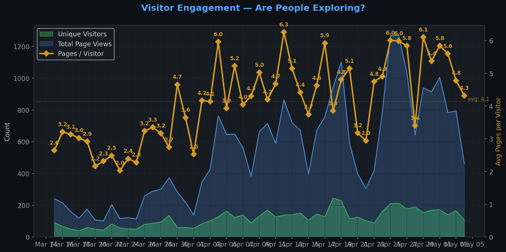
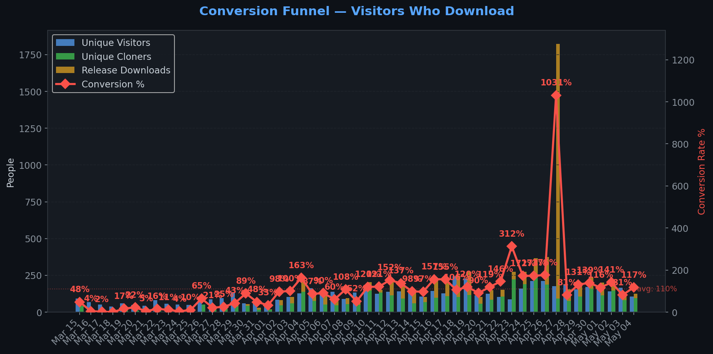
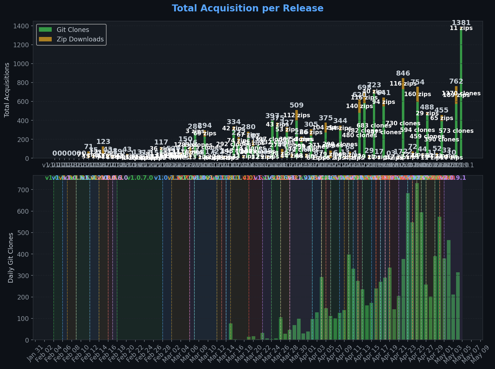
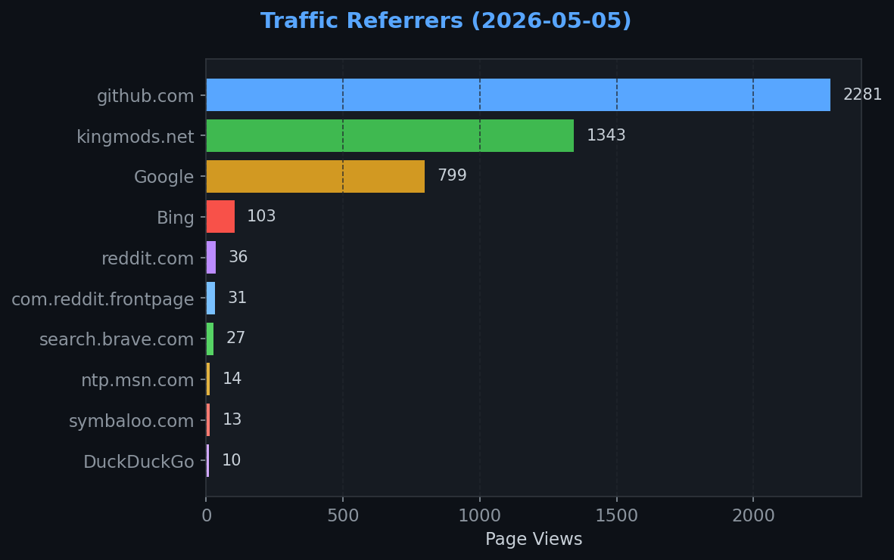
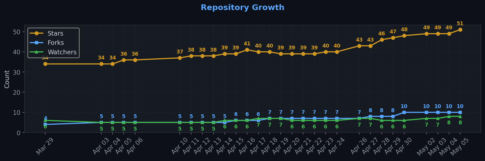

# Repository Traffic Dashboard

**Last updated:** 2026-05-05T06:22:36Z
**Days tracked:** 29 | **Download snapshots:** 442 (hourly)

---

## Views & Clones (14-day window, preserved forever)

| Metric | 14-Day Total | Unique |
|--------|-------------|--------|
| Page Views | 11013 | 1031 |
| Git Clones | 5928 | 1573 |

> **Engagement:** 10.6 pages per visitor (14-day avg)

---

## Visitor Engagement

> Higher = visitors exploring more pages. 1.0 = bounce. 3.0+ = deeply engaged.

---

## Conversion Funnel

> **14-day conversion:** 3181 of 1031 visitors cloned or downloaded (**308.5%**)
>
> Unique cloners: 1573 | Release downloads: 1608

---

## Total Acquisition per Release (Downloads + Clones)

| Channel | Count |
|---------|-------|
| Zip Downloads | 1608 |
| Git Clones (14-day) | 5928 |
| **Total Acquisitions** | **7536** |

---

## Referrers

| Source | Views | Unique |
|--------|-------|--------|
| github.com | 2281 | 175 |
| kingmods.net | 1343 | 295 |
| Google | 799 | 172 |
| Bing | 103 | 30 |
| reddit.com | 36 | 20 |
| com.reddit.frontpage | 31 | 24 |
| search.brave.com | 27 | 4 |
| ntp.msn.com | 14 | 3 |
| symbaloo.com | 13 | 1 |
| DuckDuckGo | 10 | 6 |

---

## Repository Growth

| Metric | Current |
|--------|---------|
| Stars | 51 |
| Forks | 10 |
| Watchers | 8 |

---

## Top Pages (14-day)

| Page | Views | Unique |
|------|-------|--------|
| `/TheCodingDad-TisonK/FS25_SoilFertilizer` | 3789 | 844 |
| `/TheCodingDad-TisonK/FS25_SoilFertilizer/releases` | 1173 | 262 |
| `/TheCodingDad-TisonK/FS25_SoilFertilizer/issues` | 1096 | 175 |
| `/TheCodingDad-TisonK/FS25_SoilFertilizer/releases/tag/v2.0.9.0` | 252 | 152 |
| `/TheCodingDad-TisonK/FS25_SoilFertilizer/releases/tag/v2.0.6.0` | 224 | 109 |
| `/TheCodingDad-TisonK/FS25_SoilFertilizer/discussions` | 168 | 63 |
| `/TheCodingDad-TisonK/FS25_SoilFertilizer/releases/tag/v1.9.9.9` | 139 | 83 |
| `/TheCodingDad-TisonK/FS25_SoilFertilizer/pulls` | 117 | 57 |
| `/TheCodingDad-TisonK/FS25_SoilFertilizer/releases/tag/v1.9.8.0` | 107 | 72 |
| `/TheCodingDad-TisonK/FS25_SoilFertilizer/wiki` | 103 | 42 |

---

## Data Files

| File | Description | Granularity |
|------|-------------|-------------|
| [daily.json](daily.json) | Views & clones per day (never expires) | Daily |
| [downloads.json](downloads.json) | Release download snapshots | Hourly |
| [referrers.json](referrers.json) | Referrer snapshots | Daily |
| [metadata.json](metadata.json) | Stars, forks, watchers | Daily |
| [stats.json](stats.json) | Combined legacy snapshots | 6-hourly |

---
*Hourly download tracking + full dashboard with engagement metrics every 6 hours*
*Auto-generated by [traffic-stats.yml](../../.github/workflows/traffic-stats.yml)*
